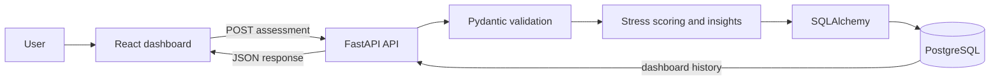

# PulseCheck

PulseCheck is a full-stack stress monitoring and recommendation system. It turns a short daily wellness check-in into a transparent stress score, contributing factors, practical recommendations, and a trend over time.

## Stack

- **Frontend:** React + Vite, Lucide icons, responsive CSS dashboard
- **Backend:** FastAPI, Pydantic validation, SQLAlchemy
- **Database:** PostgreSQL 16
- **Deployment:** Dockerfiles for the API and static frontend, Docker Compose for local PostgreSQL

## Run locally

Prerequisites: Python 3.12+, Node 20+, npm, and Docker.

1. Start PostgreSQL:

   ```bash
   cp .env.example .env
   # Replace the YOUR_* values in .env with local values.
   docker compose up -d db
   ```

2. Start the API:

   ```bash
   cd backend
   python -m venv .venv
   source .venv/bin/activate
   pip install -r requirements.txt
   uvicorn app.main:app --reload --env-file ../.env --port 8000
   ```

   API documentation is available at `http://localhost:8000/docs`.

3. Start the frontend in a second terminal:

   ```bash
   cd frontend
   npm install
   npm run dev
   ```

   Open `http://localhost:5173`. The client loads and saves data only through the API; there is no seeded or fallback demo data.

### Environment configuration

Copy `.env.example` to `.env` for local configuration, or copy `frontend/.env.example` to `frontend/.env` when configuring the client separately. `.env` is ignored by git and must never be committed. Set `VITE_API_URL` to the deployed API base URL, including `/api`, before running `npm run build`. Set `DATABASE_URL` in the backend process environment.

## API

The API is available locally at `http://localhost:8000` and publishes interactive OpenAPI documentation at `/docs` and `/redoc`.

### `GET /api/health`

Returns `{ "status": "ok" }`.

### `GET /api/users/{email}/dashboard`

Returns the user profile, the latest assessment, and all previous assessments ordered newest first. Returns `404` when an email has no profile.

### `POST /api/assessments`

Accepts a JSON body like:

```json
{
  "name": "Alex Morgan",
  "email": "alex@example.com",
  "sleep_duration": 7.2,
  "work_hours": 8,
  "mood_level": 7,
  "screen_time": 5.2,
  "physical_activity": 45,
  "heart_rate": 74,
  "blood_oxygen": 98
}
```

The endpoint creates a profile if the email is new, otherwise updates the name and appends a new assessment. All numeric inputs are constrained by Pydantic validation before business logic runs.

The response contains `id`, `stress_score`, `stress_level`, `summary`, `factors`, `recommendations`, `created_at`, and the original seven measurements. Validation ranges are: sleep, work, and screen time from 0 to 24 hours; mood from 1 to 10; physical activity from 0 to 1,440 minutes; heart rate from 35 to 220 bpm; and blood oxygen from 70% to 100%.

Example response:

```json
{
   "id": 12,
   "stress_score": 35,
   "stress_level": "Medium",
   "summary": "A few patterns suggest your system could use more recovery today.",
   "factors": ["Short sleep duration", "Long workday"],
   "recommendations": ["Aim for 7–9 hours of consistent sleep tonight."],
   "created_at": "2026-09-06T08:30:00",
   "sleep_duration": 6.4,
   "work_hours": 10,
   "mood_level": 7,
   "screen_time": 4,
   "physical_activity": 45,
   "heart_rate": 72,
   "blood_oxygen": 98
}
```

## Assessment logic

The score starts at zero. Each signal adds points when it crosses a stress-risk threshold:

| Signal | Trigger | Points |
| --- | --- | ---: |
| Sleep | Less than 7 hours | 20 |
| Work | More than 9 hours | 15 |
| Mood | 4 or below | 20 |
| Screen time | More than 7 hours | 15 |
| Physical activity | Less than 30 minutes | 15 |
| Resting heart rate | More than 90 bpm | 10 |
| Blood oxygen | Less than 95% | 10 |

Levels are **Low** below 30, **Medium** from 30 through 59, and **High** at 60 or above. Each triggered rule contributes a plain-language factor and recommendation. This is a wellness heuristic, not a medical diagnosis; the UI makes that boundary explicit.

## Database schema

`users` stores the unique email profile and creation date. `assessments` stores every submitted lifestyle snapshot, its calculated score and level, generated summary, serialized factors, recommendations, and timestamp. The `user_id` foreign key cascades when a profile is removed. SQLAlchemy creates the tables on API startup; the equivalent SQL is also available in `backend/schema.sql`.

| Table | Important columns | Purpose |
| --- | --- | --- |
| `users` | `id`, `name`, `email`, `created_at` | One profile per email address. |
| `assessments` | `user_id`, seven input measurements, `stress_score`, `stress_level` | Immutable daily assessment history. |
| `assessments` | `summary`, `factors`, `recommendations`, `created_at` | Generated insight content and trend timestamp. |

The database uses a one-to-many relationship: one user can have many assessments. The application serializes the factor and recommendation arrays as JSON text in PostgreSQL and converts them back to arrays in API responses.

## Architecture



The frontend owns form state, loading states, charts, and presentation. The backend owns validation, user lookup or creation, scoring, recommendations, and persistence. This keeps the stress rules authoritative and prevents a client-side result from being treated as saved until the API confirms it.

The frontend uses `VITE_API_URL` when supplied and defaults to `http://localhost:8000/api`. This makes the same bundle usable with a hosted API:

```bash
VITE_API_URL=https://your-api.example.com/api npm run build
```

## Deployment

### Backend and database

1. Create a PostgreSQL database through a managed provider such as Neon, Supabase, Railway, or Render.
2. Deploy `backend/Dockerfile` to a Python container service.
3. Set `DATABASE_URL` in the backend service environment. Do not upload `.env` files or place database credentials in source control.
4. Expose port `8000` and confirm `/api/health` returns `{ "status": "ok" }`.

### Frontend

1. Set `VITE_API_URL=https://your-api.example.com/api` as a build environment variable.
2. Deploy `frontend/Dockerfile` to a container/static host, or run `npm run build` and publish `frontend/dist`.
3. Add the deployed frontend origin to `allow_origins` in `backend/app/main.py`.
4. Test a new assessment and an existing user's dashboard from the public frontend.

FastAPI exposes API documentation automatically at `/docs` and `/redoc`. For production, add authentication, HTTPS, database backups, migrations, rate limiting, and an appropriate privacy policy before storing real health-related data.

### Local Docker alternative

```bash
cp .env.example .env
# Replace all YOUR_* values in .env.
docker compose up -d db
docker build -t pulsecheck-api ./backend
docker run --rm --env-file .env -p 8000:8000 pulsecheck-api
```

Before production, restrict `allow_origins` in `backend/app/main.py` to the exact frontend domain, add authentication, and encrypt or minimize health data according to the deployment's privacy requirements.

## Voice assistant

The dashboard includes an opt-in **Voice** control in the header. It uses the browser Web Speech API: `SpeechRecognition` converts the user's voice into a command and `speechSynthesis` reads the result aloud. Supported commands include:

- “Check my stress level” reads the latest score, level, and summary.
- “Show my history” reads the number of saved check-ins and recent scores.
- “Give recommendations” reads the latest personalized recommendations.
- “Help me reset” starts a short guided breathing exercise.

Voice input requires microphone permission and is supported by browsers that expose `SpeechRecognition` or `webkitSpeechRecognition`, commonly Chrome and Edge. The regular click and form workflow remains available when voice input is unsupported or declined.
# health_check